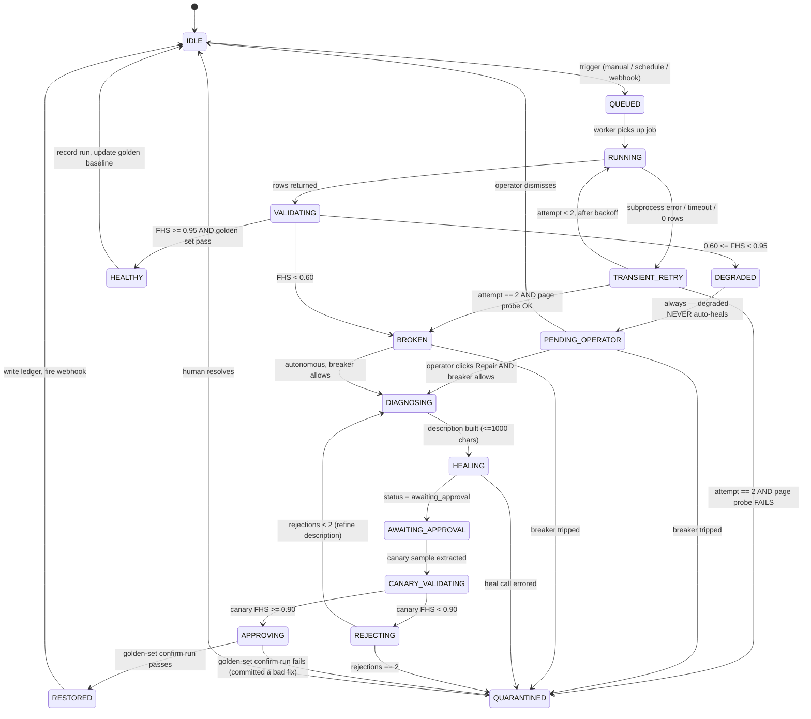
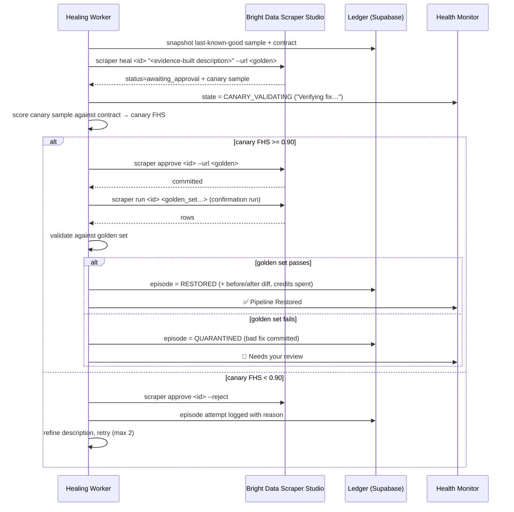

# Master Weaver — Healing State Machine Specification

**Document 01 of the Master Weaver planning suite**
Status: DRAFT — planning artifact, written 2026-08-12 (pre-build)
Author: System Architect (pdkokare1)
Build window: 2026-08-17 → 2026-08-23. **No code from this document may be committed before Aug 17.**

> This is an architecture blueprint. Every fenced block is *specification pseudocode or a data shape*,
> not shippable source. It exists to be handed to a coding agent on Day 2, not to be compiled.

---

## 0. Thesis

Bright Data already ships self-healing. `brightdata scraper heal` exists, and so does `--auto-approve`.
Every team in this hackathon will call it. Calling it is not a product.

The `heal` command deliberately **stops at an approval gate** and hands back a sample of what the
repaired scraper would produce. Bright Data left a human standing at that gate on purpose.

> **Master Weaver is the thing that stands at the gate.**
> We never pass `--auto-approve`. We earn the approval — by validating the proposed fix against a
> contract and a golden set *before* committing it, and by rejecting fixes that don't clear the bar.

That single sentence is the pitch, the differentiator, and the reason this document is the most
important one in the suite. Everything below is the machinery that makes it true.

---

## 1. Glossary (read this first)

| Term | Plain-English meaning |
|---|---|
| **Collector** | A scraper living in Bright Data Scraper Studio. Has a `collector_id` like `c_mpohus372o5tmid1jk`. |
| **Run** | One execution of a collector against one or more URLs. Produces rows. |
| **Contract** | Our declaration of what "good output" looks like for a given collector. The thing we validate against. |
| **FHS (Field Health Score)** | A single 0–1 number summarising how healthy a run's output is. Drives every decision. |
| **Golden set** | Up to 3 pinned URLs whose correct output we recorded when the scraper last worked — `min(3, available)`. Our regression test. |
| **Canary** | The sample output `heal` returns at the approval gate. We validate *this* before approving. |
| **Episode** | One complete attempt to recover a broken scraper: diagnose → heal → validate → approve/reject, possibly looped. |
| **Ledger** | The append-only audit trail of every episode. The demo's money shot. |
| **Quarantine** | Terminal state where the machine gives up and escalates to a human. Deliberate, not a bug. |
| **Transient failure** | The site was slow/blocked/down. Nothing is broken. Healing this wastes credits and can *damage* a working scraper. |
| **Structural failure** | The site changed its DOM. This is the real thing. Heal it. |

The transient/structural distinction is the most common way naive implementations of this loop fail.
See §4.3 — we spend one cheap API call to disambiguate, every time.

---

## 2. The State Machine

### 2.1 States

| State | Meaning | Public UI label |
|---|---|---|
| `IDLE` | Nothing in flight | `Idle` |
| `QUEUED` | Job accepted, worker not yet started | `Queued` |
| `RUNNING` | `scraper run` subprocess in flight | `Scraping…` |
| `VALIDATING` | Rows returned; scoring against contract | `Checking data…` |
| `HEALTHY` | FHS ≥ 0.95, golden set passed | `✅ Healthy` |
| `TRANSIENT_RETRY` | Suspected network/block failure; backing off | `Retrying…` |
| `DEGRADED` | 0.60 ≤ FHS < 0.95 — partial breakage | `⚠️ Degraded` |
| `BROKEN` | FHS < 0.60 or zero rows with a live page | `⚠️ Layout Change Detected` |
| `PENDING_OPERATOR` | A `DEGRADED` break, halted awaiting a human go-ahead | `⚠️ Degraded — repair needs your approval` |
| `DIAGNOSING` | Building the plain-English fix description | `Diagnosing…` |
| `HEALING` | `scraper heal` subprocess in flight | `⚠️ Layout Change Detected — Healing…` |
| `AWAITING_APPROVAL` | Bright Data returned a proposed fix + canary sample | `Reviewing proposed fix…` |
| `CANARY_VALIDATING` | Scoring the canary sample against the contract | `Verifying fix…` |
| `APPROVING` | `scraper approve` in flight | `Committing fix…` |
| `REJECTING` | `scraper approve --reject` in flight | `Fix rejected — retrying…` |
| `RESTORED` | Post-approval golden-set run passed | `✅ Pipeline Restored` |
| `QUARANTINED` | Circuit breaker tripped; human needed | `🛑 Needs your review` |

Your original spec had four public labels (`Idle` / `Scraping...` / `⚠️ Layout Change - Healing...` /
`✅ Pipeline Restored`). Keep those four as the *headline* badge, and expose the finer states as a
sub-caption. Judges read the headline; the sub-caption is what proves there's a real machine underneath.

### 2.2 Transition diagram



### 2.3 The one non-obvious edge

`APPROVING → QUARANTINED` is the dangerous path: the fix passed canary but failed the real
golden-set run, and we've *already committed* it. See §8 on why forward-fix is our only rollback, and
why that makes the canary gate load-bearing rather than decorative.

---

## 3. The Validation Contract

A contract is declared per collector, once, at creation time — inferred by the LLM from the user's
natural-language intent, then editable in the UI.

### 3.1 Shape

```jsonc
{
  "collector_id": "c_mpohus372o5tmid1jk",
  "fields": [
    { "name": "product_name", "type": "text",   "required": true,  "min_fill": 0.95 },
    { "name": "price",        "type": "number", "required": true,  "min_fill": 0.90,
      "range": [1, 100000], "drift_tolerance": 0.40 },
    { "name": "in_stock",     "type": "boolean","required": false, "min_fill": 0.50 },
    { "name": "product_url",  "type": "url",    "required": true,  "min_fill": 0.95, "absolute": true }
  ],
  "row_count": { "min": 5, "drift_tolerance": 0.50 },
  "golden_set": ["https://…/p/1", "https://…/p/2", "https://…/p/3"],  // min(3, available)
  "golden_set_shape": "detail"                                        // "detail" | "listing"
}
```

### 3.2 Field Health Score

Per field:

```
fill_rate(f)  = rows with non-null, non-empty value / total rows
type_pass(f)  = rows whose value parses as declared type / non-null rows
field_score(f)= fill_rate(f) × type_pass(f)
```

Per run, weight required fields double:

```
FHS = Σ(weight(f) × field_score(f)) / Σ(weight(f))       weight = 2 if required else 1
```

Then apply run-level penalties (multiplicative, clamped to [0,1]):

```
row_penalty    = clamp(row_count / trailing_median_row_count, 0, 1)
golden_penalty = golden_set_match_rate                      (see §3.4)
FHS_final      = FHS × row_penalty × golden_penalty
```

**Thresholds** — `≥0.95` healthy · `0.60–0.95` degraded · `<0.60` broken · canary gate at `≥0.90`.

**Severity determines autonomy (ARCHITECT DECISION, locked 2026-08-12):**

| Band | Reading | Behaviour |
|---|---|---|
| FHS < 0.60 | Catastrophic layout failure | **Auto-heals autonomously.** No human in the loop. |
| 0.60 ≤ FHS < 0.95 | Minor DOM shift, partial breakage | **Halts at `PENDING_OPERATOR`.** Notifies, waits for a click. |

There is no per-workspace toggle. The tiering *is* the product statement: the system distinguishes a
catastrophic failure it should fix itself from a partial one where a human should decide. Both paths
then run the identical diagnose → heal → canary → approve/reject sequence — the only difference is
who authorises entry.

Note the second-order consequence: **the Chaos Lab needs two break modes**, one per band. See doc 02
§10.1 (`?layout=v2` total, `?layout=v3` partial) and doc 04 Beat 5.

Tune these on Day 3 against the Chaos Lab. They are the single most important set of magic numbers
in the product; write them in one config object, not scattered through the code.

### 3.3 Why fill-rate and not a null check

Your original trigger was "fields return `undefined`". That misses the failure mode that actually
happens: a site redesign changes *one* field's location, so 12 of 14 fields still work and price
silently returns empty on 70% of rows. A null check on the first row would say everything's fine.
Fill-rate catches it. **Partial breakage is the common case; total breakage is the rare one.**

### 3.4 Golden set — what you can and cannot assert

You cannot assert exact values. Prices change hourly; that's the entire point of the product. So the
golden set records, at last-known-good, per pinned URL:

- exact match required: `product_name`, `sku`, `product_url`
- presence + type required: every other contract field
- numeric tolerance: `price` within ±35% of the recorded value (catches `0`, `null`, `"$"`, and
  the classic "scraped the shipping cost instead" failure — without false-alarming on a real sale)

`golden_set_match_rate` = passing pinned URLs / total pinned URLs.

**Size: `min(3, available_urls)`.** Never reject a collector for having too few. A judge pasting one
product URL is the most likely first interaction with the product, and failing that with a validation
error is a terrible opening.

**Two collector shapes, two baseline semantics** — the code must know which it holds:

| Shape | Example | Golden set | Baseline asserts |
|---|---|---|---|
| **Detail-page** | 3 product URLs, 1 row each | those 3 URLs | 3 baseline rows; per-row field values |
| **Listing-page** | 1 category URL yielding 40 rows | that 1 URL | the **row set** — row count within tolerance, field shape across rows, and the first N rows by a stable key |

A listing-page collector cannot assert three individual products, because it has one URL. It asserts
that the page still yields roughly the same number of rows with the same field shape. Both forms feed
`golden_set_match_rate` identically; only what counts as "passing" differs.

**A golden set of 1 is a weaker regression test** than one of 3 — a single passing URL says less. Do
**not** compensate by raising the canary threshold (that would make small collectors harder to repair
than large ones, which is backwards). Instead, surface the size in the UI so the confidence level is
visible rather than implied — doc 05 §6.

Refresh the baseline on every `HEALTHY` run. Never refresh it from a `DEGRADED` or post-heal run
until `RESTORED` — otherwise you slowly ratchet your own quality bar downward, which is how these
systems rot in production.

---

## 4. Detection

### 4.1 Trigger sources

| Source | Cadence |
|---|---|
| Manual run from the UI | user-initiated |
| Workspace schedule | every 30 min for the flagship price-tracking workspace |
| Post-heal confirmation | immediately after `APPROVING` |

### 4.2 Every run is validated

There is no "unvalidated" path. Manual runs, scheduled runs, and confirmation runs all pass through
`VALIDATING`. One code path, one score, one ledger row.

### 4.3 Transient vs. structural — the cheap probe

Before spending a heal (which costs credits and *mutates a working collector*), disambiguate:

```
on suspected failure:
  probe = `brightdata scrape <golden_url> --json`     # cheap raw fetch, no extraction
  if probe fails or returns block/captcha/5xx markers:
      → TRANSIENT: back off (1m, 5m), retry the run, do NOT heal
  if probe succeeds and returns substantial page content:
      → STRUCTURAL: the page is fine, our extraction is not. Heal.
```

Retry budget: 2 transient retries at 1m and 5m. Exhausting them with a *failing* probe means the
site is blocking us or is down — that's `QUARANTINED`, not `BROKEN`. Healing a scraper because
Cloudflare had a bad afternoon is how you turn a working scraper into a broken one.

---

## 5. Diagnosis — the part that is genuinely ours

`scraper heal` takes a **plain-language problem description, max 1000 characters**. The quality of
that string determines whether the fix works. Generating a good one *automatically, from evidence*
is the core intellectual property of this project. Say so in the pitch.

### 5.1 Evidence bundle

Assemble before writing the description:

1. **Failed fields** — name, declared type, fill-rate before vs. after, type-pass rate
2. **Last known good row** — one full example from the golden baseline
3. **Current bad row** — the same URL's current output, showing exactly what came back instead
4. **Page context** — `brightdata scrape <url> --json` (markdown form), then extract the ~400
   characters surrounding the last-known-good value of the worst-affected field. This is what tells
   the healer *where the data moved to*.

### 5.2 Description template

Budget the 1000 characters deliberately — the page context is the first thing to truncate, the
before/after example is the last:

```
The scraper stopped extracting {N} field(s) after a site layout change.

BROKEN: {field}: was {fill_before}% filled, now {fill_after}%.
        Previously returned {good_example}, now returns {bad_example}.
        [repeat for up to 3 worst fields]

STILL WORKING: {list of healthy field names}

The value now appears on the page near this content:
{page_context_excerpt}

Please update the extraction logic for the broken field(s) only.
Do not change the fields that still work.
```

That last line matters more than it looks. Unconstrained healing has a habit of "fixing" fields that
were never broken. Pinning the healthy fields is free insurance and it's the kind of detail a judge
who has run scrapers in production will immediately recognise as real.

### 5.3 Refinement on rejection

If the canary fails and we retry, do **not** resend the same description. Append what the previous
attempt got wrong:

```
A previous fix attempt was rejected because {field} still returned {observed}
instead of a {expected_type}. Try a different approach for that field.
```

Two refinement attempts, then quarantine. Diminishing returns past that, and each attempt costs
credits.

---

## 6. Heal execution

### 6.1 Command contract

```
brightdata scraper heal <collector_id> "<description ≤1000 chars>" --url <golden_url> --json
```

**Never `--auto-approve`.** Repeat it in a code comment where the flag would otherwise be typed,
because some future agent will "helpfully" add it.

Expected response: `status: "awaiting_approval"` plus a sample output preview.

### 6.2 Subprocess discipline (Windows)

The CLI is CLI-only — no Node SDK — so every call is a subprocess:

- spawn with `shell: true` (Windows resolves the `.cmd` shim, not a bare binary)
- always pass `--json`; the CLI suppresses colours/spinners off-TTY but don't rely on it
- capture stdout and stderr **separately** — the CLI writes data to stdout and errors to stderr
- hard timeout per call (heal: 300s, run: 180s, scrape: 60s), kill the process tree on expiry
- `BRIGHTDATA_API_KEY` from env; never interactive login on the server
- log the exact argv (with the key redacted) into the ledger — reproducibility is a clean-code point

---

## 7. Verification — the approval gate

This is the section that wins the reliability criterion.



**Canary gate is 0.90, stricter than the 0.60 that triggered the heal.** A fix must be clearly good,
not merely better than broken. Asymmetric thresholds are deliberate: cheap to reject, expensive to
commit something wrong.

---

## 8. Rollback — be honest about this

`heal` mutates the collector **in place and preserves the `collector_id`**. That's a feature (every
schedule, trigger and integration keeps working) but it means:

> There is no version-rollback in the CLI surface. Once approved, the previous extraction logic is gone.

Therefore:

1. **Primary rollback = rejection at the gate.** `scraper approve --reject` before commit is the only
   true undo. This is *why* we never auto-approve. The architecture follows from the constraint.
2. **Secondary = forward-fix.** If a bad fix is committed, issue a new heal whose description is built
   from the stored last-known-good sample: *"restore extraction of `price`, which previously returned
   values like `1299.00` from this page."* Because we snapshot the good sample before every episode,
   we always have that evidence. Most systems don't.
3. **Snapshot before every heal, unconditionally.** Cheap, and it's what makes both the diff in the
   UI and the forward-fix possible.

**Day-1 verification item:** check whether the CLI or API can read back a collector's extraction
template (the heal endpoint is `POST /dca/collectors/{id}/refactor_template`, which implies a template
exists). If it can, snapshot the *code* and show a real code diff in the ledger — dramatically better
demo. If it can't, snapshot the *output shape* and diff that instead. Design for both; ship whichever
is available. Don't let this block the loop.

---

## 9. Circuit breaker & cost governance

An autonomous heal loop is a runaway-spend machine. These rails are not optional.

| Rail | Limit | On breach |
|---|---|---|
| Heal attempts per collector | 3 per rolling 24h | `QUARANTINED` + webhook |
| Rejections per episode | 2 | `QUARANTINED` + webhook |
| Transient retries per run | 2 (1m, 5m backoff) | reclassify per §4.3 |
| Credits per episode | soft cap, configurable | abort episode, quarantine |
| Account credit floor | halt all autonomous healing below threshold | global pause + banner |
| Global kill switch | env flag | worker refuses to heal, runs still execute |

Poll `brightdata budget` before each episode and after each run; write `credits_before` /
`credits_after` into the ledger. Two payoffs: a live credit meter in the sidebar (Bright Data judges
notice cost-awareness), and a real number for the pitch — *"the average autonomous repair costs
N credits and takes M seconds."* A concrete number beats an adjective every time.

Say the breaker out loud in the demo. "It knows when to stop and ask a human" is a maturity signal
that separates a product from a script.

---

## 10. The Healing Ledger

Append-only. One row per episode, one child row per attempt. This is the demo's money shot — a
judge scrolling this table sees evidence, not marketing.

**`healing_episodes`**

```
id, collector_id, workspace_id
triggered_at, resolved_at, final_state           # RESTORED | QUARANTINED
trigger_reason                                    # DEGRADED | BROKEN
fhs_before, fhs_after
failed_fields[]                                   # names + fill before/after
snapshot_before                                   # last-known-good sample row(s) / template
snapshot_after
credits_spent, duration_ms, attempt_count
```

**`healing_attempts`**

```
id, episode_id, attempt_no
description_sent                                  # the exact ≤1000-char string
canary_sample, canary_fhs
decision                                          # APPROVED | REJECTED
rejection_reason
cli_argv_redacted, stderr_excerpt
```

UI surface: a timeline per collector, each episode expandable into before/after diff + the exact
description the machine wrote + the canary score that justified the decision. Ship the "attempt 1
rejected, attempt 2 approved" case in the demo if you get one naturally — a system that rejects its
own bad fix is more convincing than one that always succeeds first try.

---

## 11. Failure taxonomy

| Where | Failure | Response |
|---|---|---|
| `RUNNING` | subprocess timeout | kill tree, transient retry |
| `RUNNING` | CLI auth error | quarantine immediately, banner — not a heal case |
| `RUNNING` | 0 rows, page probe OK | structural → heal |
| `RUNNING` | 0 rows, page probe fails | transient/blocked → quarantine after retries |
| `VALIDATING` | contract missing | infer from first healthy run, warn |
| `DIAGNOSING` | description > 1000 chars | truncate page context first, then field list |
| `HEALING` | heal returns error not `awaiting_approval` | log raw, quarantine |
| `HEALING` | heal returns already-approved / no gate | **Day-1 verification item** — fall back to post-hoc validation + forward-fix |
| `CANARY_VALIDATING` | canary sample empty/malformed | treat as FHS 0 → reject |
| `APPROVING` | approve errors | retry once, then quarantine |
| any | credits exhausted | global pause, webhook, banner |

---

## 12. Day-1 verification checklist (first 3 hours, before any UI work)

**Owner: the architect, personally** (decision locked 2026-08-12). Opus does not run this; Opus starts
Day 1 on `packages/contracts` and the subprocess adapter, gated as described in §12.2.

The entire product rests on assumptions read from documentation. Test them before building on them.
Do this manually in a terminal — it isn't repo code and it de-risks the whole week.

- [ ] `brightdata scraper create <chaos-lab-url> "<intent>"` returns a `collector_id`
- [ ] `brightdata scraper run <id> <url> --json` returns a parseable JSON array
- [ ] Flip the Chaos Lab to `layout=v2` — confirm the run degrades rather than erroring
- [ ] `brightdata scraper heal <id> "<description>" --url <url> --json` returns `awaiting_approval`
- [ ] **Confirm the response actually contains a usable canary sample** ← the load-bearing assumption
- [ ] `brightdata scraper approve <id> --reject` cleanly discards the fix; the old behaviour persists
- [ ] `brightdata scraper approve <id> --url <url>` commits; a subsequent run returns good rows
- [ ] Can the extraction template be read back? (real code diff vs. output-shape diff)
- [ ] `brightdata budget --json` returns a machine-readable balance
- [ ] Measure: seconds per heal, credits per heal, credits per run → these become pitch numbers
- [ ] Subprocess spawn works from Node on Windows with `shell: true` and `--json`

### 12.1 Terminal runbook

Run in order. Capture **every** raw JSON response to a file — those files become
`docs/samples/` (a required submission artifact) and the fixtures Flash builds the scorer against.

```bash
npm install -g @brightdata/cli
export BRIGHTDATA_API_KEY="…"          # PowerShell: $env:BRIGHTDATA_API_KEY="…"
brightdata budget --json                                              # baseline balance

brightdata scraper create <chaos-lab-url> "Extract product name, price, RAM, storage, stock" --json
brightdata scraper run <collector_id> <chaos-lab-url> --json -o run_v1.json

# flip the Chaos Lab to ?layout=v2, then:
brightdata scraper run <collector_id> "<chaos-lab-url>?layout=v2" --json -o run_v2_broken.json
brightdata scrape "<chaos-lab-url>?layout=v2" --json -o probe.json     # transient-vs-structural probe

brightdata scraper heal <collector_id> "Price and product name stopped extracting after a layout change" \
  --url "<chaos-lab-url>?layout=v2" --json -o heal_response.json       # NO --auto-approve
#   ↑ inspect heal_response.json — THE load-bearing check. Is there a machine-readable canary sample?

brightdata scraper approve <collector_id> --reject --json               # prove rejection is clean
brightdata scraper run <collector_id> "<chaos-lab-url>?layout=v2" --json # confirm still broken → reject worked

brightdata scraper heal <collector_id> "…" --url "…?layout=v2" --json
brightdata scraper approve <collector_id> --url "<chaos-lab-url>?layout=v2" --json
brightdata scraper run <collector_id> "<chaos-lab-url>?layout=v2" --json -o run_v2_healed.json
brightdata budget --json                                                # cost of one full episode
```

**Record four numbers before you green-light Opus:** seconds per heal, credits per heal, credits per
run, and **credits per page load**. The first three set the circuit-breaker ceilings (§9) and the
closing line of the demo (doc 04 Beat 7). The fourth sets the cron interval — see below.

### 12.1a Deriving the cron interval from measurement, not guesswork

The price-history cron (Day 2) is the one demo asset that cannot be added late, and it is also the
only thing that spends credits continuously for five days. Size it from the measured number rather
than assuming:

```
credits_per_page_load  = (budget_before - budget_after) / urls_in_run
daily_burn             = credits_per_page_load × urls_tracked × (24 × 60 / interval_minutes)
five_day_burn          = daily_burn × 5
```

**Rule: five-day cron burn must stay under 15% of your total balance** (free tier 5,000/mo + the $50
promo). That leaves the rest for development runs, the chaos drills, and the healing episodes — which
are what actually matter.

| Five-day burn at 30-min interval | Action |
|---|---|
| under 15% of balance | Keep 30 minutes. |
| 15–35% | Drop to hourly — 120 points per product over five days is still a dense chart. |
| over 35% | Drop to 2-hourly (60 points) and cut tracked products to 3. |

A chart needs enough points to look continuous, not enough to be lossless. Sixty points across five
days draws a perfectly convincing line.

> **Never seed synthetic history into the run table.** Doc 04 Beat 4 narrates this chart as *"five
> days of real price history"* on camera, to judges, with the repository public. If the cadence has
> to drop to protect credits, drop it — the honest sparse chart is worth more than a dense fabricated
> one, and the seeder would be visible in the repo. The chart's *movement* problem is solved in the
> Chaos Lab instead (doc 02 §10.1), not with a seeder.

**Also confirm the Groq model is live** (doc 03 §6.3). Groq retired `llama-3.3-70b-versatile` on
2026-08-16 — one day before Day 1 — while still listing it on the general models page. Model IDs
there churn; spend ten seconds proving the one you're building on responds:

```bash
curl -s https://api.groq.com/openai/v1/models \
  -H "Authorization: Bearer $GROQ_API_KEY" | grep -o '"id":"[^"]*"' | sort
#   ↑ confirm openai/gpt-oss-120b is present and NOT flagged deprecated
```

### 12.2 What Opus is and isn't blocked on

Do **not** hold all of Day 1 behind the green light. The dependency is narrow:

| Work | Blocked? |
|---|---|
| `packages/contracts` — state enum, contract shape, thresholds, ledger types | **No.** Start immediately. The 17 states are valid under either verification outcome. |
| `brightdata` adapter — spawn, `--json`, timeouts, redaction, `create` / `run` / `scrape` / `budget` | **No.** These paths are unambiguous. |
| Adapter `heal` / `approve` path + the canary parser | **Yes.** Shape depends on `heal_response.json`. |

So the green light gates roughly the last hour of Opus's Day 1, not the first six. If the canary
assumption fails, the fallback (approve → confirmation run → validate → forward-fix) is in §8, and
contracts, breaker, diagnosis and ledger are all unaffected.

If the canary-sample assumption fails, the fallback is: approve → confirmation run → validate →
forward-fix if bad. Weaker (we commit before verifying) but the loop still stands, and the ledger,
contract, breaker and diagnosis layers are all unaffected. Know this fallback before Day 1 so a
surprise costs you an hour instead of an afternoon.

---

## 13. What this buys you against the rubric

| Criterion (each ~1/6) | How this document scores it |
|---|---|
| Reliability & self-healing | The whole document. Contract, canary gate, breaker, ledger, honest rollback story. |
| Use of Scraper Studio | Uses `create`/`run`/`heal`/`approve`/`scrape`/`budget` — the real depth of the surface, not one endpoint. |
| Technical excellence | Asymmetric thresholds, transient/structural disambiguation, evidence-built prompts, append-only audit. |
| Creativity | "We refuse `--auto-approve`" is a genuinely novel stance on a tool everyone else will use naively. |
| Presentation clarity | The ledger *is* the demo. Evidence on screen beats narration. |
| Impact | A repair that costs N credits and M seconds, with a human escalation path, is a product a company would actually run. |

---

## 14. Open questions for the architect

1. ~~Auto-heal by default, or ask first?~~ **RESOLVED 2026-08-12** — `BROKEN` autonomous,
   `DEGRADED` halts at `PENDING_OPERATOR`. No toggle. See §3.2.
2. ~~Golden set size.~~ **RESOLVED 2026-08-12, amended 2026-08-13 — `min(3, available_urls)`.**
   `GOLDEN_SET_MAX = 3` is the constant in `@weaver/contracts`; the actual set is capped by how many
   URLs the collector has. **Collector creation never fails for having too few URLs.** The original
   "exactly 3, reject below" rule would have rejected a single pasted product URL — which is the most
   likely first thing a judge tries. See §3.4.
3. **Contract editing in the UI.** Worth ~3 hours on Day 4 if ahead of schedule; skip otherwise.
   Inferred contracts are enough for the demo.
4. **Do transient failures notify?** Recommendation: no webhook for transient, webhook for every
   quarantine and every successful heal. Alert fatigue is a real design flaw judges will notice.

---

*Next documents in the suite: 02 — Agent Prompt Library & Repo Structure · 03 — Revised PRD &
System Architecture · 04 — Demo Script (four minutes, one beat per criterion).*
