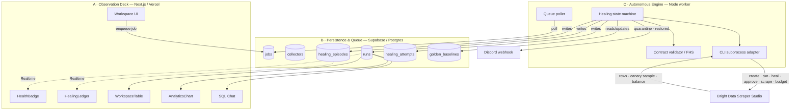
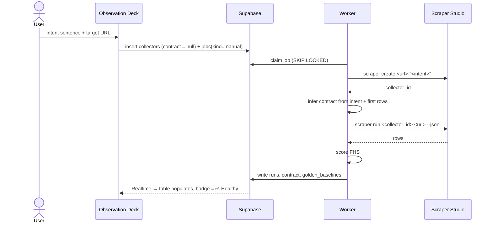
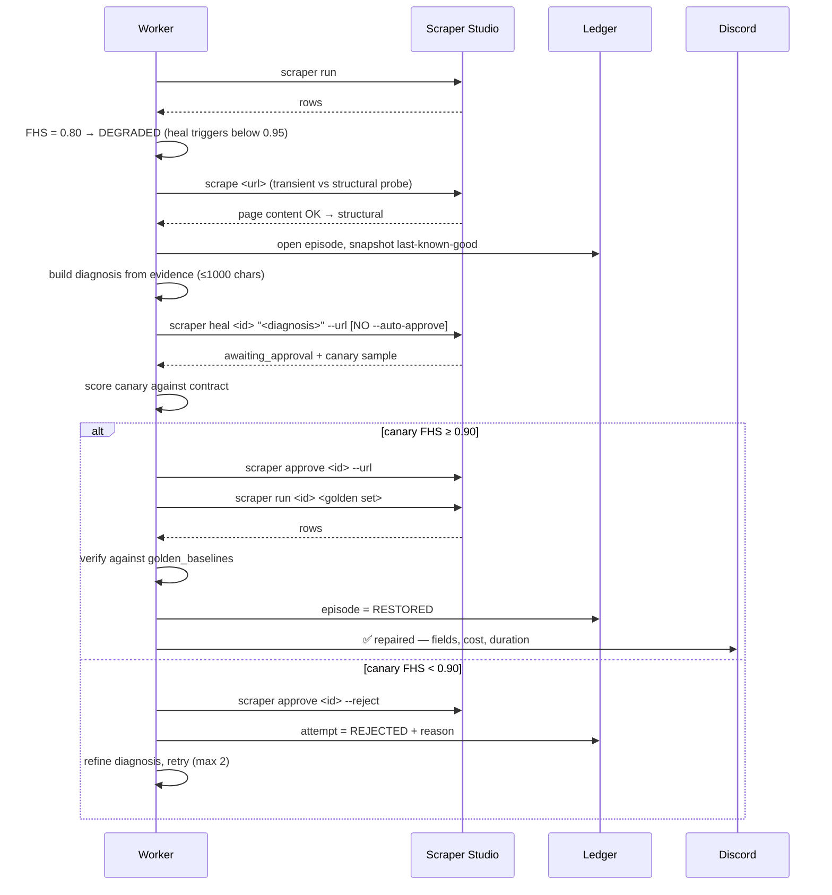
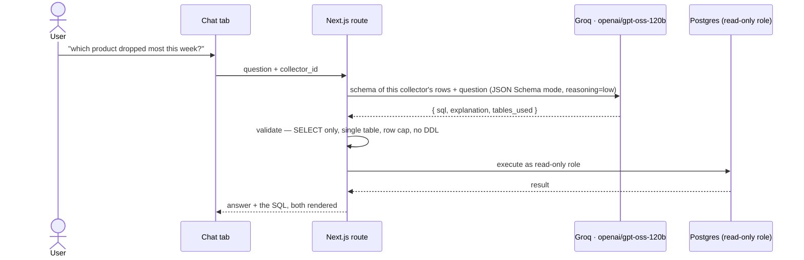

# Master Weaver — PRD & System Architecture

**Document 03 of the Master Weaver planning suite**
Entry for **"Into the Scrape-Verse"** — WeMakeDevs × Bright Data, Aug 17–23 2026.
Status: EXECUTION ARTIFACT — written 2026-08-12 (pre-build)
Depends on: `01_HEALING_STATE_MACHINE.md`, `02_AGENT_ALLOCATION_AND_REPO.md`, `04_DEMO_SCRIPT.md`
Build window: 2026-08-17 → 2026-08-23. **No code from this document is committed before Aug 17.**

> Synthesis document. Where this conflicts with 01, 02 or 04, **those documents win** — they are the
> primary specs and this is the map that ties them together. Section 9 lists the decisions still
> open to the architect.

---

## 1. Executive summary

**The problem.** Web scrapers fail silently and partially. A site redesign moves one field; thirteen
others keep working; nobody notices for a week. Naive auto-healing makes it worse — it burns credits
repairing transient network failures, and it commits AI-proposed fixes without checking them, turning
a degraded scraper into a broken one.

**The product.** Master Weaver is a resilient scraping engine with an observation deck. You describe
what you want in a sentence; it builds a Bright Data Scraper Studio collector, runs it on a schedule,
scores every run against a contract, and repairs itself when the target changes — with an audit trail
for every decision.

**The core IP — one sentence.** Bright Data's `heal` command stops at an approval gate and hands back
a sample of the proposed fix. **We stand at that gate.** We never pass `--auto-approve`. The system
scores the proposed canary against the same contract that caught the break, at a stricter threshold,
and autonomously rejects fixes that don't clear it.

That stance is not stylistic. Healing rewrites the collector **in place, preserving the collector ID**
— there is no version rollback in the CLI surface. Rejection at the gate is the only true undo the
platform offers. The architecture follows from the constraint.

### 1.1 Naming (locked 2026-08-12)

**Master Weaver.** In Spider-Verse lore, the Master Weaver sits at the Loom and maintains the Web of
Life and Destiny — mapping the threads that connect every reality, and mending them when they break.
On-theme for a Spider-Verse hackathon without being derivative, and an accurate description of the
product rather than a decoration on it.

| Slot | Value |
|---|---|
| Product name | **Master Weaver** |
| Repo | `master-weaver` |
| Package scope | **`@weaver/*`** — `@weaver/contracts`, `@weaver/healing`, `@weaver/validation`, `@weaver/brightdata` |
| Tagline | "Turns a sentence into a production scraper — and mends it when the web breaks." |

The name earns its place by supplying a vocabulary the rest of the product can borrow — *the Loom*
(the engine), *threads* (field extractions), *frayed* vs *snapped* (partial vs total breakage),
*mending* (the heal cycle). Use it in prose, ADR titles, and demo narration.

> **Guardrail: the lore never reaches the UI.** Every label, badge, column header, button and error
> message stays in plain English — `⚠️ Layout Change Detected`, never `⚠️ Thread Frayed`. The Suit-Up
> criterion is "finished and *readable*"; a judge who has to translate a label is reading a themed
> toy rather than a product. See doc 04 §6.1 and doc 05 §9.

---

## 2. Product requirements

### 2.1 Personas

| Persona | Needs | What they'd cancel over |
|---|---|---|
| **E-commerce analyst** | Price/stock tracking across competitors, alerts on movement | Charts that silently went stale two weeks ago |
| **Market researcher** | Listings and reviews turned into something queryable | Having to file a ticket every time a source site redesigns |
| **AI developer** | Structured, reliable feed into a downstream pipeline | Ingesting nulls without knowing it |

All three share one failure mode: **they find out late.** The product's job is to make breakage loud,
repair it unattended, and prove what it did.

### 2.2 Value propositions

1. **Sentence to production scraper** — no selectors, no schema authoring.
2. **Breakage is detected, not discovered** — fill-rate contracts catch the partial failures a null
   check misses.
3. **Repairs are verified before they commit** — the differentiator.
4. **Every repair leaves a receipt** — diagnosis, canary score, cost, duration, decision.
5. **It knows when to stop** — circuit breaker and human escalation instead of an unbounded loop.

### 2.3 Non-goals (explicit)

Multi-tenancy, authentication, scraping behind logins or paywalls, generic ETL, scheduled export
delivery, and browser-based visual selector picking. Stated so no agent builds them on initiative.

---

## 3. System architecture

Three strictly decoupled layers. The decoupling exists so three AI agents can build in parallel
without collisions (doc 02 §2).

### 3.1 Layer map



### 3.2 Layer A — Observation Deck

**Stack:** Next.js App Router, Tailwind, Shadcn UI, TanStack Table, Recharts.
**Role:** read-only observation plus job enqueueing. **No scraping logic, no CLI calls, no healing
decisions.** The client never blocks on a scrape.

| Component | Responsibility | Owner (doc 02) |
|---|---|---|
| `HealthBadge` | 16 internal states → 4 headline labels, live via Realtime | Pro |
| `HealingLedger` | Episode timeline; expands to attempts, diff, canary score, cost | Pro |
| `WorkspaceTable` | TanStack table over run rows; sort, filter, resize | Pro |
| `AnalyticsChart` | Recharts time-series over run history | Pro |
| `SQLChat` | Question → generated SQL (shown) → result | Pro (UI) / Opus (route) |
| `CreditMeter` | Live balance from `brightdata budget` | Flash |
| leaf UI | buttons, badges, inputs, JSON viewer | Flash |

### 3.3 Layer B — Persistence & Queue

Supabase Postgres. Doubles as job queue (no separate broker — a queue table plus `FOR UPDATE SKIP
LOCKED` is sufficient at this scale and removes an entire dependency) and as the Realtime transport
that drives the live UI.

### 3.4 Layer C — Autonomous Engine

Node worker, long-running, outside Vercel's request timeout. Owns the entire state machine from doc 01.

**Deployment: Railway / Fly / Render free tier — a Day 5 task, not an afterthought.**

Vercel serverless kills a function in 10–60s. A full healing episode (detect → probe → diagnose →
heal → canary → approve → confirm) runs 30–60s and can exceed it. The worker therefore **cannot** run
as a Vercel function — but the conclusion is *deploy it elsewhere*, not *run it on your laptop*:

- **Judging happens after submission.** Doc 04 closes holding the live URL on screen with *"go break
  it."* If the worker only runs locally, a judge clicking that link after the event gets a static
  shell — no runs, no healing, no ledger movement. That forfeits the "finished" criterion the live
  URL exists to win.
- **The price cron dies whenever the laptop sleeps**, putting gaps in the five-day history.

The worker is a Node process with a queue poller and no inbound HTTP surface — the easiest possible
thing to deploy. Budget ~30 minutes on Day 5.

**Fallback (documented, not planned):** if deployment fights back, run locally, say so plainly in the
README, and cut the *"go break it"* line from Beat 7. Do not let an agent attempt to deploy the
worker to Vercel — repairs will time out mid-episode and the failure will look like a healing bug.

**Bright Data CLI surface used** — via `child_process` with `shell: true` (Windows resolves the `.cmd`
shim), `--json` always, stdout/stderr captured separately, per-command timeouts, argv logged with the
API key redacted:

| Command | Used for |
|---|---|
| `scraper create <url> "<intent>"` | Collector creation from natural language |
| `scraper run <id> <url> [--urls]` | Scheduled + manual runs, golden-set confirmation |
| `scraper heal <id> "<diagnosis>" --url` | Repair proposal — **never with `--auto-approve`** |
| `scraper approve <id> --url` | Commit a fix that cleared the canary gate |
| `scraper approve <id> --reject` | Discard a fix that didn't — the primary rollback |
| `scrape <url>` | Transient-vs-structural probe (doc 01 §4.3) |
| `budget` | Credit meter, per-episode cost accounting |

---

## 4. Data model

Six tables. This is the corrected schema — `healing_attempts`, `golden_baselines` and `jobs` are all
load-bearing and were missing from the earlier draft.

```
collectors
  id, workspace_id, collector_id (Bright Data), name, target_url, intent_prompt
  contract JSONB            -- fields, thresholds, row_count rules (doc 01 §3.1)
  status, created_at

golden_baselines            -- the regression test; without it RESTORED is unverified
  id, collector_id, url, baseline_row JSONB, captured_at
  shape (detail|listing)    -- detail: baseline_row is one row. listing: it is the row SET summary
                            --   (row_count, field shape, first N rows by stable key)
  -- size is min(3, available_urls) — creation NEVER fails for having too few (doc 01 §3.4)
  -- refreshed ONLY on a HEALTHY run, never post-heal until RESTORED (doc 01 §3.4)

jobs                        -- queue; claimed with FOR UPDATE SKIP LOCKED
  id, collector_id, kind (manual|scheduled|confirmation), state, attempts
  scheduled_for, claimed_at, claimed_by, error

runs
  id, collector_id, job_id, started_at, finished_at
  rows JSONB, row_count
  fhs NUMERIC, field_scores JSONB, run_state, credits_spent

healing_episodes
  id, collector_id, workspace_id, triggered_at, resolved_at
  final_state (RESTORED|QUARANTINED|DISMISSED), trigger_reason (DEGRADED|BROKEN)
  authorised_by (AUTONOMOUS|OPERATOR)   -- BROKEN → AUTONOMOUS; DEGRADED → OPERATOR
  operator_prompted_at, operator_acted_at  -- null on the autonomous path
  fhs_before, fhs_after, failed_fields JSONB
  snapshot_before JSONB, snapshot_after JSONB
  credits_spent, duration_ms, attempt_count

healing_attempts            -- one row per heal attempt; enables the rejected→approved ledger entry
  id, episode_id, attempt_no
  description_sent TEXT     -- the exact ≤1000-char diagnosis
  canary_sample JSONB, canary_fhs NUMERIC
  decision (APPROVED|REJECTED), rejection_reason
  cli_argv_redacted, stderr_excerpt, created_at
```

**Why `healing_attempts` is not optional:** doc 04 Beat 5e calls the *"attempt 1 rejected, attempt 2
approved"* episode the strongest ten seconds in the video. A single episode row can only ever record
a success. Without the child table, that shot does not exist.

**Ledger integrity rule:** every state transition writes its row *before* the next CLI call is made,
so an episode interrupted by a crash is still auditable up to the point of failure.

---

## 5. Sequence diagrams

Your original prompt asked for four flows. Two of them (batch document upload, SERP discovery) are
now **cut** — see §6.1. These four reflect the actual shipped scope.

### Flow A · Natural-language scraper creation



### Flow B · Autonomous detect → heal → verify

Outer loop only. The authoritative version, with all guards and thresholds, is doc 01 §2.2 and §7.



### Flow C · Scheduled monitoring & alerting

```mermaid
sequenceDiagram
    participant C as Cron (30 min)
    participant DB as Supabase
    participant W as Worker
    participant D as Discord

    C->>DB: enqueue jobs(kind=scheduled) for active collectors
    W->>DB: claim job
    W->>W: run → score → append to run history
    alt FHS ≥ 0.95 — healthy
        W->>DB: HEALTHY; refresh golden_baselines
    else FHS < 0.60 — catastrophic, breaker allows
        W->>W: enter healing episode AUTONOMOUSLY (Flow B)
    else 0.60 ≤ FHS < 0.95 — partial
        W->>DB: PENDING_OPERATOR (no heal call made)
        W->>D: ⚠️ degraded — price filling 30%, repair needs approval
        Note over W,D: waits for a UI click; heal is never issued unattended
    else breaker tripped
        W->>DB: QUARANTINED
        W->>D: 🛑 needs review — attempts exhausted
    end
```

### Flow D · Text-to-SQL chat



**Why SQL and not vector RAG:** the scraped data is structured rows. "Cheapest item under 16GB" is an
aggregation, and embeddings are unreliable at numeric comparison. Generating SQL yields verifiable
answers, and showing the query on screen converts a commodity chat feature into a trust feature.

---

## 6. Feature scope

### 6.1 CUT — do not build

| Feature | Reason |
|---|---|
| Auth / multi-tenant | Judges never log in. Use a browser-local workspace ID. Costs a day, scores zero. |
| Visual drag-drop schema builder | Contradicts the pitch — the product exists to remove manual schema authoring. |
| Vector RAG chat | Replaced by text-to-SQL. Better answers, less work. |
| PDF export | Browser print-to-PDF covers it. |
| Smart document upload (PDF/Word/Excel → URLs) | Office parsing is a day-long tarpit for one demo second. |
| **SERP / discovery search** | **Explicitly cut.** `brightdata discover` exists and would be ~4 hours, but it adds no rubric coverage the other beats don't already provide. Recorded here as a decision, not an omission. |
| Slack webhook | Discord only. Slack if — and only if — Day 5 runs ahead. |
| **Interactive Discord approval** (buttons / `/approve`) | **Explicitly deferred**, replaced by an enriched alert + deep link. Needs a Discord application, interactions endpoint, Ed25519 verification and a 3s response window (~2h), and an approval action should bind to an operator identity the product doesn't yet have. See §6.3. |

### 6.2 CORE — must exist by Day 6

**Engine (Opus):** contract validator + FHS scorer interface · transient probe · diagnosis builder ·
heal → canary → approve/reject gate · golden-set confirmation · circuit breaker · ledger writes ·
CLI adapter · job queue.

**Demo-critical infrastructure:** Chaos Lab with **three** layouts (Day 1) · 30-minute price cron
(**Day 2 — the one item that cannot be added late**) · ≥3 real ledger episodes including one rejection
**and at least one of each authorisation path (AUTONOMOUS and OPERATOR)** · Discord alerts ·
credit meter · the `PENDING_OPERATOR` repair-approval UI (a badge state plus one button).

**Client (Pro/Flash):** health badge · ledger timeline · TanStack table · Recharts history · SQL chat ·
CSV/XLSX export · JSON view · empty/loading/error states.

### 6.3 Implementation notes on the four supporting features

**Workspace persistence.** Workspace ID in `localStorage`, no account. A workspace is a row plus its
collectors; "re-run" enqueues jobs for all of them. Pre-seed one flagship workspace so a judge landing
cold sees populated data, history, and ledger entries within two seconds.

**Export engine.** Client-side. SheetJS for `.xlsx`, hand-rolled CSV (quote-escaping is the only trap),
`Blob` + object URL download. Exports the *current filtered view*, not the raw set — matching what the
user sees is the whole point. ~2 hours, Flash.

**Text-to-SQL.** Dedicated read-only Postgres role, `SELECT`-only validation, single-table allow-list
scoped to the active collector, hard `LIMIT`, statement timeout. Render the SQL beside the answer.
Opus owns this — untrusted input reaching a database is a security surface, not a UI feature.

**Provider: Groq** (architect decision, 2026-08-12). Runs in the Next.js route handler, not the worker.

| Parameter | Value |
|---|---|
| Model | **`openai/gpt-oss-120b`** |
| Auth | `GROQ_API_KEY` (env; needed by the web app, not the worker) |
| SDK | OpenAI-compatible — point the `openai` client at Groq's base URL. No extra dependency. |
| Output | **JSON Schema mode**, pinned to `{ sql, explanation, tables_used[] }` |
| Reasoning effort | **`low`** — output is ~60 tokens; reasoning latency defeats the point of Groq |

> ⛔ **Do NOT use `llama-3.3-70b-versatile`.** Groq shut it down for free and developer tiers on
> **2026-08-16 — the day before Day 1.** It still appears on Groq's general models page, which is
> precisely what makes it a trap. `qwen/qwen3.6-27b` is also rejected: Groq recommends it as a
> replacement, but it carries **Preview** status, and a preview model can be pulled without notice
> after judging begins. `openai/gpt-oss-120b` is production, ~500 tps, and the only one of the three
> supporting JSON *Schema* mode.

**The model is not a security control.** Validation runs on the generated SQL regardless of provider —
assume the model can emit `DROP TABLE` and make that harmless. Swapping providers changes accuracy;
it must never change the safety posture.

**Discord webhook.** One URL, no app config. Fires on exactly three events: `RESTORED`,
`QUARANTINED`, and `PENDING_OPERATOR` (the degraded-halt — it is an actionable request, not noise).
**Never on transient failures, and never on autonomous state transitions in between** — alert fatigue
is a design flaw a judge will notice.

```jsonc
// RESTORED
{ "embeds": [{ "title": "✅ Pipeline restored — <collector name>",
  "color": 5763719,
  "fields": [
    { "name": "Fields repaired", "value": "price, in_stock" },
    { "name": "FHS", "value": "0.80 → 0.97" },
    { "name": "Attempts", "value": "2 (1 rejected)" },
    { "name": "Cost", "value": "34 credits · 41s" }
  ]}]}

// PENDING_OPERATOR — the only actionable alert. Carries enough context to decide
// WITHOUT opening the app, and a deep link for when you choose to.
{ "embeds": [{ "title": "⚠️ Degraded — repair needs your approval",
  "description": "<collector name> · partial breakage detected",
  "color": 16436245,
  "fields": [
    { "name": "Health",         "value": "0.95 → 0.80" },
    { "name": "Fields failing", "value": "price — filling 30% of rows (was 95%)" },
    { "name": "Still healthy",  "value": "product_name, ram_gb, storage_gb, in_stock" },
    { "name": "Proposed fix",   "value": "<first 300 chars of the generated diagnosis>" }
  ],
  "url": "https://<app>/c/<collector_id>?action=repair"   // ← the deep link
}]}
```

**Deep link contract.** `/c/<collector_id>?action=repair` lands on the collector with the repair
confirmation already open, the diagnosis rendered, and the amber badge in view — one click from
Discord to a decision. No inbound route, no Discord application, no signature verification.

> **Interactive in-chat approval (buttons / `/approve`) is deferred — recorded as a decision, not an
> omission.** Buttons and slash commands are both Discord *interactions*: they require a registered
> application, an interactions endpoint, Ed25519 signature verification, and a 3-second response
> window. That is ~2 hours against a Day 5 that is already full.
>
> The stronger reason is architectural: **an approval action must eventually bind to an operator
> identity in the ledger.** `healing_episodes.authorised_by` currently records *that* a human
> authorised a repair; it should be able to record *which* human. A chat button cannot supply that,
> and adding a second unauthenticated approval surface widens exposure without adding capability.
> The dashboard is where identity will live when it exists, so the control belongs there.
>
> ⚠️ **Wording discipline:** do not claim this as a security *control* — v1 has no authentication at
> all (§2.3), so the deep link is not authenticated either. Claim the design *direction*. Overstating
> it invites a judge to ask "authenticated by what?" and turns a good decision into a credibility hit.

---

## 7. Corrected execution timeline

Changes from the earlier draft are marked **▲**. The rationale for each is in §8.

| Day | Opus 5 | Gemini 3.1 Pro | Gemini 3.6 Flash | You |
|---|---|---|---|---|
| **1 · Aug 17** | ● **`packages/contracts`** → `brightdata` adapter (`create`/`run`/`scrape`/`budget`) → pin full dependency set. Heal/approve path gated on your green light (doc 01 §12.2) | Design tokens, app shell, sidebar, empty states (doc 05) | ● Chaos Lab **v1/v2/v3** + deploy | ● **You run the CLI verification checklist** (doc 01 §12.1, ~3h) → green-light Opus. Supabase + Vercel, redeem `wemakedevs`, ADR-001 |
| **2 · Aug 18** | ▲ **Freeze contracts AM** → worker + job queue → first end-to-end scrape → ▲ **start the 30-min cron** | Workspace shell + TanStack table | ▲ **`packages/validation` — FHS scorer implementation *and* tests** | Verify first real rows; ADR-002 |
| **3 · Aug 19** | State machine, diagnosis builder, circuit breaker | Health monitor + Realtime subscription | CSV/XLSX export, JSON viewer, fixtures | Tune FHS thresholds against Chaos Lab |
| **4 · Aug 20** | Approval gate end-to-end; **first autonomous heal**; ledger writes | Recharts view + ledger timeline | Discord webhook, credit meter, `docs/samples/` | Watch a real heal; ADR-003 (why not `--auto-approve`) |
| **5 · Aug 21** | Text-to-SQL (read-only role, validation) → ● **deploy the worker to Railway/Fly/Render** (~30 min, §3.4) | Polish pass, responsive, dark mode | Error/loading states, README scaffolding | Draft demo narration; rehearse aloud with a timer |
| **6 · Aug 22** | **Chaos drill (v2 *and* v3) + mandatory review pass** (doc 02 §8) | Final visual polish + screenshots | Bug queue only — no new surface | **Record fallback demo take** · ● remote, full day available |
| **7 · Aug 23** | README + `SCRAPER_STUDIO_INTEGRATION.md` + ADR cleanup, incl. **ADR-005 (bypass-override deferral)** | Frozen | Frozen | Record final demo, submit |

**Day 6 is a feature freeze.** Anything not working that morning is cut, not finished.

### 7.1 Why contracts must be written Day 1

`packages/contracts` holds the 16-state enum, the contract shape, the FHS thresholds and the ledger
types. Pro builds the health monitor on Day 3 against states the state machine doesn't emit until
Day 4 — that only works if the types exist first. Written Day 2, they cannot be frozen Day 2, and both
other agents spend Day 2–3 building against a moving target. This is the single sequencing dependency
that makes three agents faster than one (doc 02 §5).

---

## 8. Corrections applied

Recorded so the deltas from the earlier Doc 03 draft are traceable.

| # | Was | Now | Consequence if unfixed |
|---|---|---|---|
| 1 | "Trigger heal if FHS < 0.60" | **Heal triggers below 0.95**; 0.60 is the DEGRADED/BROKEN severity split | The demo's own break scores **0.80** — nothing would have healed on camera |
| 2 | `healing_attempts` absent | Added | No rejected→approved ledger entry; doc 04's best ten seconds impossible |
| 3 | Golden set absent | `golden_baselines` table + confirmation gate | `RESTORED` unverified; Beat 5e has no implementation |
| 4 | Contracts frozen Day 2, never written | Written Day 1, frozen Day 2 AM | Pro and Flash build Day 2–3 against types that don't exist |
| 5 | Day 1 had no Opus lane | Verification + contracts + adapter | Most capable agent idle a full day; Day 2 overloaded and the cron slips |
| 6 | FHS scorer unassigned (Flash had tests only) | Flash owns `packages/validation`, impl + tests | Nobody writes the number every decision depends on |
| 7 | No `jobs` table though worker "polls the queue" | Added, `FOR UPDATE SKIP LOCKED` | Queue semantics undefined |
| 8 | No time for mandatory review | Day 6, alongside the chaos drill | Doc 02 §8 review list never happens |
| 9 | Discovery/SERP silently absent | Explicitly cut, §6.1 | Reads as an oversight rather than a decision |

---

## 9. Architectural decisions — LOCKED 2026-08-12

All five resolved by the architect. These are now parameters, not questions.

| # | Decision | Consequences already propagated |
|---|---|---|
| 1 | **Remote only — no SF trip.** Day 6 stays whole: chaos drill + review pass + fallback recording. No compression. | §7 Day 6 |
| 2 | **The architect runs the Day-1 CLI verification personally.** Opus starts Day 1 on `packages/contracts` + adapter; only the heal/approve path waits on the green light. | §7 Day 1 · doc 01 §12, §12.1, §12.2 · doc 02 §3 |
| 3 | **Severity gates autonomy.** `BROKEN` (<0.60) auto-heals unattended. `DEGRADED` (0.60–0.95) halts at `PENDING_OPERATOR`, notifies, and waits for a click. **No toggle.** | doc 01 §2.1, §2.2, §3.2 · §4 schema · §5 Flow C · §6.3 webhook · **doc 02 §10.1 (Chaos Lab v3)** · **doc 04 Beat 5 (new 5f)** |
| 4 | **Golden set `min(3, available_urls)`** (amended 2026-08-13 from "exactly 3"). `GOLDEN_SET_MAX = 3` in `@weaver/contracts`; **creation never fails for having too few URLs** — a single pasted product URL is the likeliest first judge interaction. Detail-page and listing-page collectors carry different baseline semantics. | doc 01 §1, §3.1, §3.4, §14 · §4 schema · doc 05 §6 |
| 5 | **Pro and Flash run concurrently in separate panes.** One-file-one-owner strictly enforced; dependency and port rails added. Escape hatch: demote Flash to pure-function bug fixes only. | doc 02 §7 rails 8–9, §12 |

### 9.1 The second-order consequence of decision 3

Decision 3 is good product design — it's the clearest possible demonstration that the system triages
rather than reflexively healing. But it invalidates doc 04's centerpiece as originally written.

The break filmed in Beat 5 is a **partial** one (price filling at 30%, thirteen other fields healthy),
which scores **FHS ≈ 0.80 — inside the DEGRADED band.** Under decision 3 that break now *halts and
waits for a click*, while the narration says *"I'm not going to touch the app"* and *"no human
involved."* Filmed as written, the video's central claim would be contradicted by what's on screen.

**Resolution — turn the constraint into the story.** The Chaos Lab gains a third layout, and the demo
films both paths:

| Layout | Break | FHS | Path | Demo beat |
|---|---|---|---|---|
| `?layout=v2` | Total restructure — every selector fails | ≈0.05 | `BROKEN` → **autonomous** | Beat 5 centerpiece, unchanged |
| `?layout=v3` | Price cell only; all other markup identical to v1 | ≈0.80 | `DEGRADED` → **PENDING_OPERATOR** | New Beat 5f, ~15s |

Cost: ~30 minutes of Flash's Day 1, and 15 seconds of runtime. Return: the video stops claiming
"it heals itself" and starts showing "it knows *when* to heal itself" — which is a materially stronger
claim, and it lands the reliability and creativity criteria harder than the autonomous path alone.

**Both drills run on Day 6**, and the ledger needs at least one episode of each type by then.

---

*Suite complete: 01 healing spec · 02 agent allocation · 03 this document · 04 demo script ·
05 design system.*
